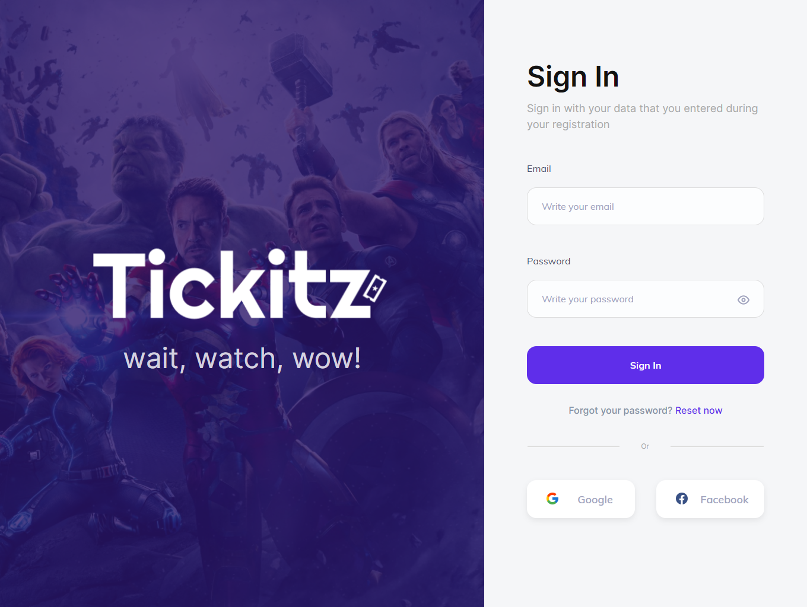
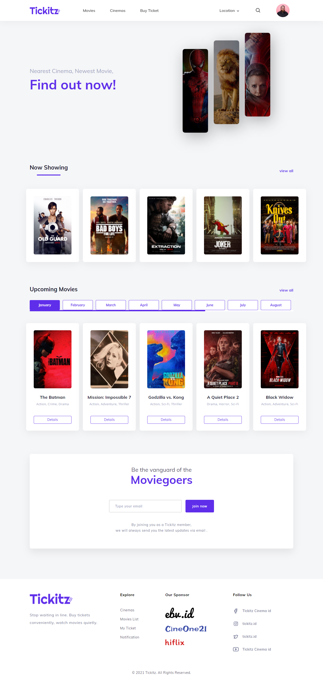
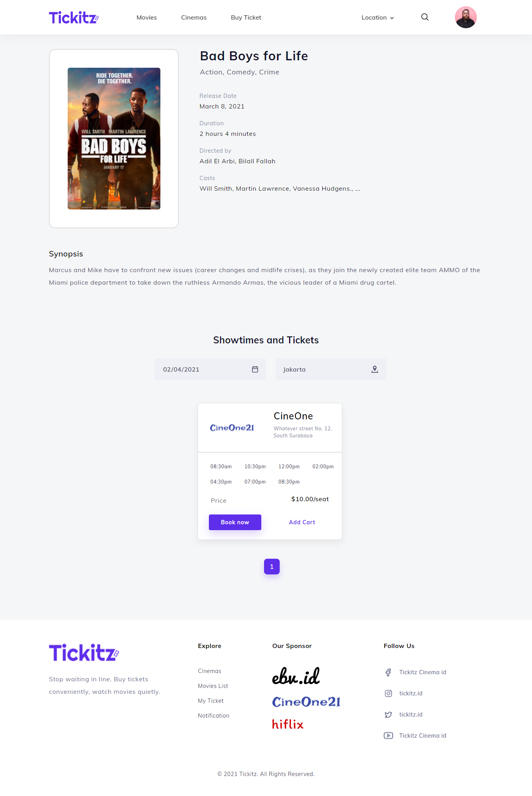
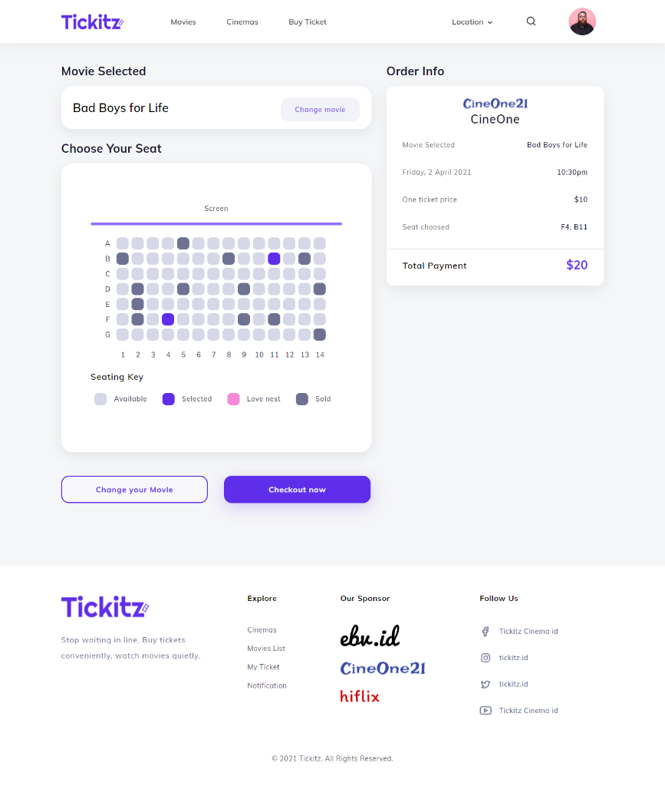
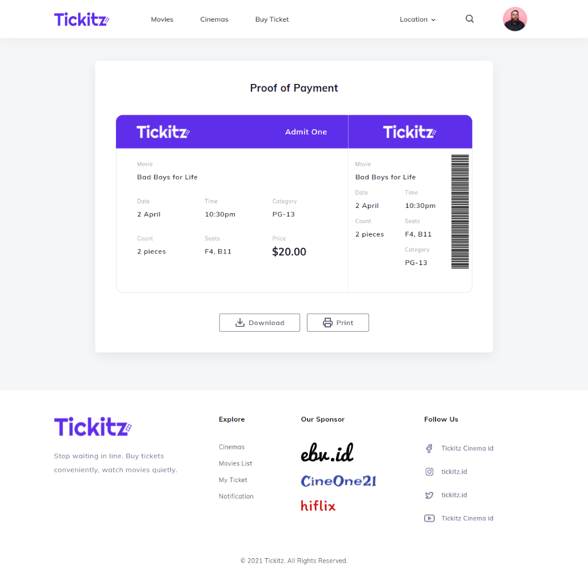
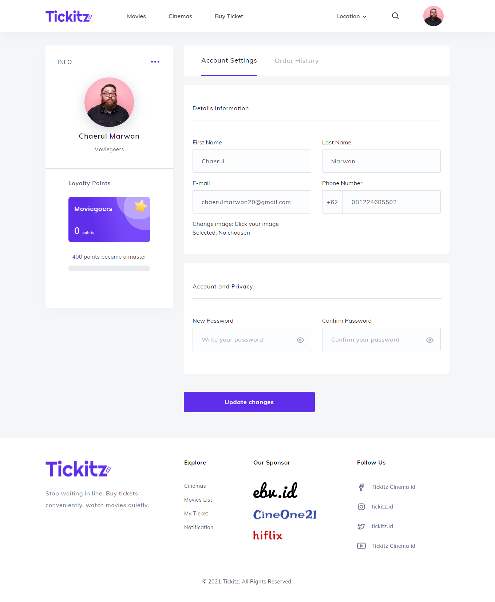
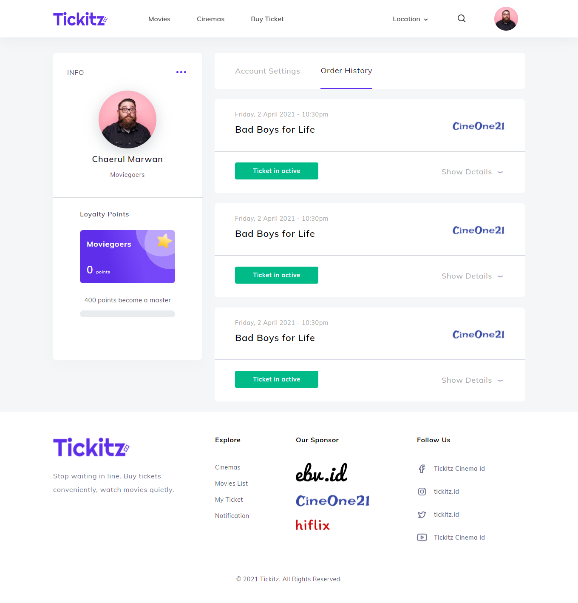

<h1 align="center">Tickitz</h1>
<p align="center">
  <a href="https://booking-tickitz-film.netlify.app/" target="_blank"></a>
</p>

## Table of Contents

- [Introduction](#introduction)
- [Features](#features)
- [Built With](#built-with)
- [Prerequisites](#prerequisites)
- [Installation](#installation)
- [Screenshots](#screenshots)
- [Related Project](#related-project)

## Introduction

The Tickitz application is a web application created using node.js and its framework called express.js. This application will make it easier for users to order or purchase tickets to watch movies in their favorite cinemas. This application will also allow users to find out the details of a film, such as the players, the director and even the synopsis. So, you can see in advance who the players are, who is the director who made the film, and what the synopsis looks like.

## Features

- Authentication

- Authorization

- Reset password

- Realtime movie search

- Order ticket

- Download ticket

- Change profile

- Upload image profile

## Built With

- [ReactJs](https://reactjs.org/)
- [Redux](https://redux.js.org/)
- [Bootstrap](https://getbootstrap.com/)

## Prerequisites

- [NodeJs](https://nodejs.org/en/download/)
- [Backend Tickitz](https://github.com/chaerulmarwan20/tickitz-film-api)

## Installation

1. Open your terminal or command prompt. Then, clone the repo.

```
$ git clone https://github.com/chaerulmarwan20/tickitz-film-frontend.git
```

2. Open this project.

```
$ cd tickitz-film-frontend
$ npm install
```

3. Create environment variable.

```
$ cp .env.example .env
```

4. Run this application.

```
$ npm start
```

## Screenshots

<p align="center">
  <span>
       
       
       
    
       
    
       
    
  </span>
</p>

## Related Project

- :white_check_mark: [`Backend Tickitz`](https://github.com/chaerulmarwan20/tickitz-film-api)
- :rocket: [`Production`](https://booking-tickitz-film.netlify.app/)
